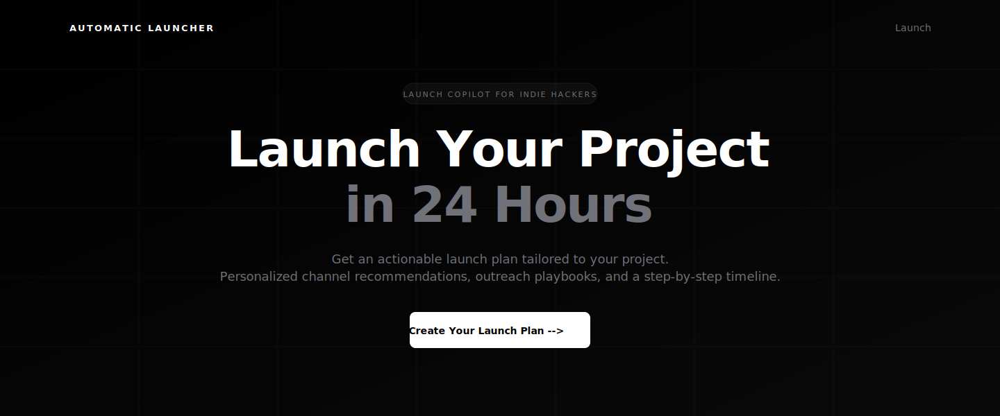
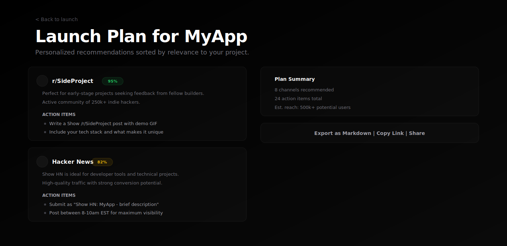
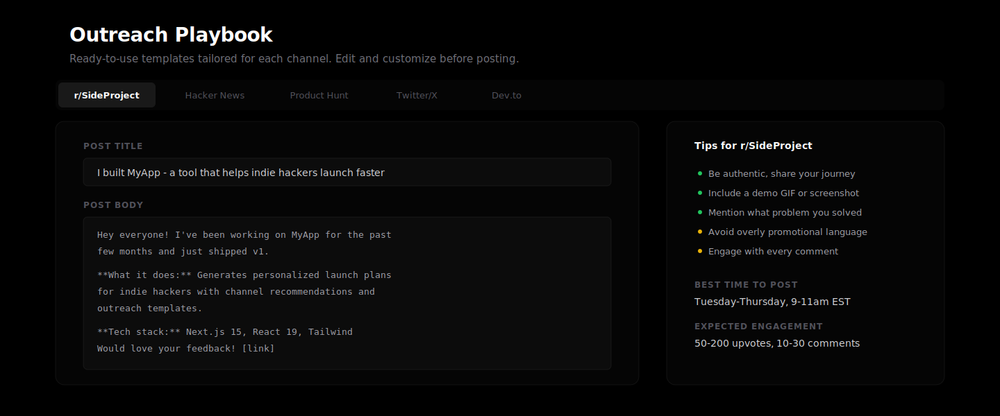
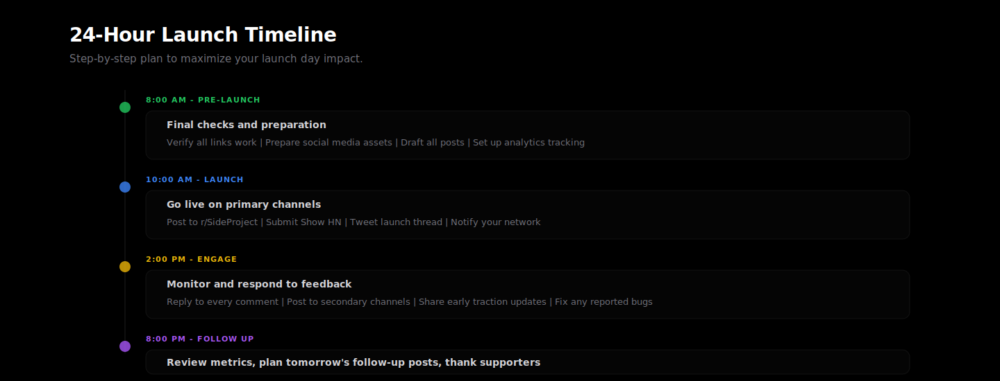

<p align="center">
  
</p>

<h1 align="center">Automatic Launcher</h1>

<p align="center">
  <strong>The launch copilot for indie hackers.</strong><br />
  Paste your project. Get a full launch plan in 60 seconds.
</p>

<p align="center">
  <a href="https://github.com/NikitaDmitrieff/automatic-launcher/actions"></a>
  <a href="https://github.com/NikitaDmitrieff/automatic-launcher/blob/main/LICENSE"></a>
  <a href="https://github.com/NikitaDmitrieff/automatic-launcher/stargazers"></a>
</p>

<p align="center">
  <a href="#quickstart">Quickstart</a> &middot;
  <a href="#features">Features</a> &middot;
  <a href="#how-it-works">How It Works</a> &middot;
  <a href="#roadmap">Roadmap</a> &middot;
  <a href="#contributing">Contributing</a>
</p>

---

## The Problem

You built something cool. Now you need users. But launching means:

- Figuring out **which channels** actually work for your niche
- Writing **different posts** for Reddit, HN, Product Hunt, Twitter...
- Knowing **the right tone** for each community (or getting roasted)
- Spending **hours planning** instead of shipping

**Automatic Launcher does this in 60 seconds.**

## Quickstart

```bash
git clone https://github.com/NikitaDmitrieff/automatic-launcher.git
cd automatic-launcher
pnpm install && pnpm dev
```

Open [http://localhost:3000](http://localhost:3000) and paste your project details.

## Features

**Channel Recommendations** -- Get matched with the best launch channels for your project type. Reddit communities, Product Hunt, Hacker News, niche forums -- with direct links.



**Outreach Playbooks** -- Ready-to-use post templates for each channel. Know exactly what to write, what tone to use, and how to frame your project.



**24-Hour Launch Timeline** -- A structured plan broken into clear steps. Know exactly what to do and when, so you spend time launching instead of planning.



## How It Works

```
Your Project Details  -->  Recommendation Engine  -->  Personalized Launch Plan
                           (rules + AI hybrid)
```

1. **Input** your project name, description, and URLs
2. **Engine** matches your project against 20+ launch channels using rules-based scoring + AI personalization
3. **Output** a complete launch plan with channel picks, post templates, and a timeline

No sign-up required. No API keys needed for the base experience.

## Tech Stack

| Layer | Tech |
|-------|------|
| Framework | Next.js 15 (App Router, RSC) |
| UI | React 19, Tailwind CSS v4 |
| Style | Minimalist glassmorphism, dark theme |
| Testing | Vitest |
| Language | TypeScript |

## Project Structure

```
src/
  app/           Next.js App Router pages, layouts, and API routes
  components/    React components (forms, channel cards, outreach editor)
  lib/           Recommendation engine, channel data, templates
  types/         TypeScript type definitions
__tests__/       Test files
```

## Roadmap

- [x] Core recommendation engine with rules-based matching
- [x] Channel cards with direct links
- [x] Outreach post templates and editor
- [x] Export launch plans
- [x] Input validation and XSS prevention
- [x] Loading states and error handling
- [ ] AI-powered personalized advice (OpenAI/Anthropic integration)
- [ ] Launch day calendar integration (Google Calendar, .ics export)
- [ ] Post scheduling integrations (Buffer, Twitter API)
- [ ] Analytics dashboard -- track which channels drove signups
- [ ] Community-contributed channel database
- [ ] Browser extension for one-click launches
- [ ] CLI tool (`npx automatic-launcher`)

## Contributing

We welcome contributions! See [CONTRIBUTING.md](CONTRIBUTING.md) for guidelines.

**Quick links:**
- [Good First Issues](https://github.com/NikitaDmitrieff/automatic-launcher/labels/good%20first%20issue)
- [Feature Requests](https://github.com/NikitaDmitrieff/automatic-launcher/labels/enhancement)
- [Bug Reports](https://github.com/NikitaDmitrieff/automatic-launcher/issues/new?template=bug_report.md)

## Star History

If Automatic Launcher helped you launch, consider giving it a star. It helps other indie hackers discover the project.

[](https://star-history.com/#NikitaDmitrieff/automatic-launcher&Date)

## License

[MIT](LICENSE) -- use it however you want.
